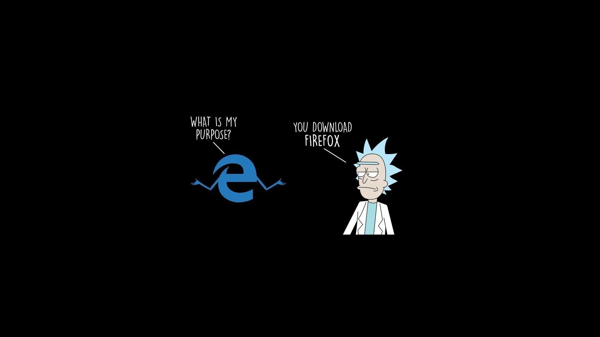

# Script.Library: Your Digital Lockpick & Swiss Army Chainsaw



Alright, you digital demigod, you've stumbled upon the motherlode. Welcome to **Script.Library**, the gloriously overstuffed, meticulously organized, and occasionally unhinged collection of scripts designed to automate, obliterate, or just plain understand the digital chaos that surrounds us. Think of it as your personal arsenal for when you need to get things done, yesterday, and preferably with a bit of flair. If there's a repetitive task grinding your gears, a data source begging to be plundered, or a system just asking for a good poke, chances are there's a script in here for that.

## What's the Arsenal?

This isn't just a folder of random code; it's a curated selection of digital weaponry and utility belts, covering everything from AI sorcery to wrestling with your video files until they submit. Each directory is a rabbit hole of potential:

*   **AI & ML Mayhem (`AI-ML/`)**:
    *   Tired of vendor lock-in or just want to pit LLMs against each other like digital gladiators? Dive in.
    *   Tools for analyzing LLM outputs, comparing models, charming terminal-based chat interfaces, and optimizing your prompts until they sing. Because if you're not making the AI sweat, you're not trying.

*   **Audio Alchemy (`Audio/`)**:
    *   Got audio files that need wrangling? From batch converting to M4A, deduplicating your sprawling music library, to yanking lyrics from Spotify for your menubar, or even making your system voices speak your mind.
    *   Includes an Apple Podcasts exporter for when you want to liberate your subscriptions.

*   **Data Pillaging (`Data Scraping/`)**:
    *   The web is your oyster, and these are your shucking knives.
    *   Scrapers for Google Search (with and without AI seasoning), tools to liberate raw data for your LLMs, and PDF document excavators. If it's out there, you can probably grab it.

*   **Document Domination (`Documents/`)**:
    *   Because paper is for Luddites and PDFs are the new currency.
    *   Scripts to convert various formats to PDF, merge PDFs into monolithic tomes, and even tools to help you review them without losing your sanity.

*   **Digital Forensics (Playing Detective) (`Forensics/`)**:
    *   Uncover the secrets hidden in files, images, and network traffic.
    *   Analyzers for file metadata, image internals, steganography detectors, and traffic inspection tools. For when you need to know what *really* happened.

*   **Git & GitHub Wizardry (`GITHub/`)**:
    *   Currently housing a nifty `github-org-cloner.py`. Because manually cloning dozens of repos is for interns. More GitHub-fu likely to come.

*   **GPU Gymnastics (`GPUs/`)**:
    *   Making your graphics cards do more than just render cat videos.
    *   Scripts to check CUDA info, test Ollama and OpenWebUI setups, benchmark Metal Performance Shaders (MPS), verify PyTorch and TensorFlow installations, and generally push your silicon to its limits.

*   **Image & Media Manipulation (`Images/`)**:
    *   Your photos and images are data. Treat them as such.
    *   A veritable toolkit for converting images to PDF, displaying all meta tags, extracting and fixing dates from XMP/filenames, batch-fixing rotation, and generally strong-arming your image metadata into submission.

*   **JSON Juggling (`JSON/`)**:
    *   Because the modern world runs on curly braces and key-value pairs.
    *   Processors for ChatGPT conversations, validators for JSON structures, a fixer/cleaner for Google Contacts, and a Google Takeout processor. Tame that structured data.

*   **Mobile Minutiae (`Mobile/`)**:
    *   Currently focused on `mobiles-media-transfer.py`. Helping you get your media off your pocket-sized overlord.

*   **NLP Ninjutsu (`NLP/`)**:
    *   Words, words, words. Time to make them work for you.
    *   Analyze the AI job market, build better resumes with AI assistance, parse JSON into structured resume formats, and generally bend language to your will.

*   **System Sorcery (`System/`)**:
    *   Your operating system is a beast. Here are some tools to tame it.
    *   Scripts for Docker backups, batch folder moves, DNS leak tests, extension scanning, advanced file moving and flattening, network utilities (bond/unbond, Roku finding), NordVPN helpers, rsync GUIs, trash recovery, and turbo-charged file movers. Basically, if your OS can do it, these scripts can probably do it faster or weirder.

*   **Video Vandalism (or Virtuosity) (`Video/`)**:
    *   From quick fixes to creative mayhem.
    *   Randomize image sequences for video, convert aspect ratios, detect auto-crop, fix GoPro metadata, interpolate frames for smoother motion, turn PNGs into 4K video, sort videos by dimensions, scan for corruption, and crop videos to standard aspect ratios.

## Why This Glorious Mess?

Because reinventing the wheel is for chumps with too much time. This library is born from years of "there has to be a script for this" moments, culminating in a collection that's part personal toolkit, part community offering. It's for the sysadmin who needs to automate a backup, the data scientist who needs to scrape a site, the media enthusiast who wants to organize their collection, and the AI tinkerer who wants to run local models without selling their soul.

It's opinionated, occasionally rough around the edges, but always aiming to be useful.

## How to Wield These Weapons

1.  **Clone the beast:**
    ```bash
    git clone https://github.com/sanchez314c/Script.Library.git
    cd Script.Library
    ```
2.  **Navigate to the relevant den of scripts:**
    Each category (e.g., `Audio/`, `System/`) has its own folder. `cd` into it.
3.  **Peruse the offerings:**
    Most scripts are Python (`.py`) or shell (`.sh`). Many will have comments or a `-h`/`--help` option.
    ```bash
    python some_script.py --help
    ./some_other_script.sh --help
    ```
4.  **Check for `requirements.txt`:**
    Some directories might have a `requirements.txt` file for Python scripts. Install them, preferably in a virtual environment:
    ```bash
    python -m venv venv
    source venv/bin/activate  # On macOS/Linux
    # venv\Scripts\activate  # On Windows
    pip install -r requirements.txt
    ```
5.  **Unleash the power:**
    Run the script. Watch the magic happen (or troubleshoot with gusto).

## The Fine Print (Requirements)

*   **Python 3.x**: The lingua franca for most of these tools. Get it, love it, live it.
*   **Shell Environment (bash/zsh)**: For the `.sh` scripts. macOS and Linux are golden. Windows users, WSL is your friend.
*   **Specific Dependencies**: Many scripts will need external Python libraries (see `requirements.txt` in relevant folders) or command-line tools (e.g., `ffmpeg` for video, `exiftool` for images). The scripts usually assume you have these. If something breaks, a missing dependency is a good first guess.
*   **A Can-Do Attitude**: And maybe a willingness to read code if things get spicy.

## License

MIT. Go nuts. Build, modify, share. Just don't blame us if you accidentally automate your cat out of the house.

## Parting Shot

This library is a living entity. It'll grow, it'll change, and some scripts might even become sentient (we're working on that). Use it, abuse it, and if you make something cool, maybe even contribute back.

Now, go forth and script something awesome. 🚀
